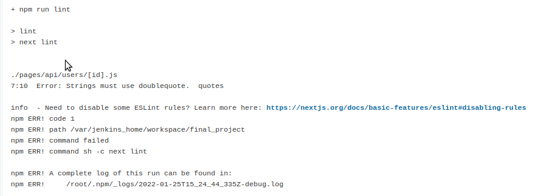
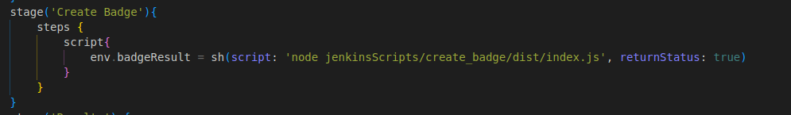
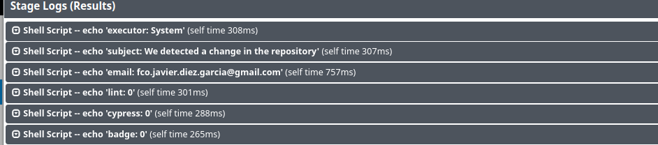
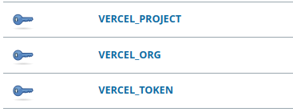
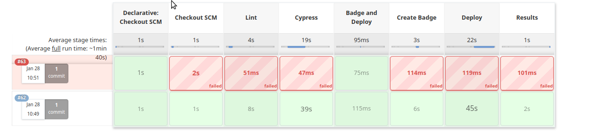

# Deploy Actions Proyect (GitHub Actions)

Creador: Fco. Javier Diez Garcia

Tipo: CFGS Proyect

Instituto: IES L'Estacio

Curso: Web Applications Development


# Index

- [Deploy Actions Proyect (GitHub Actions)](#deploy-actions-proyect-github-actions)
- [Index](#index)
- [Introduction](#introduction)
- [Teoria Github Actions](#teoria-github-actions)
- [Resultado de los Ultimos Test](#resultado-de-los-ultimos-test)
- [Steps](#steps)
  - [1. Inicio Repositorio](#1-inicio-repositorio)
  - [2. Push al Repositorio Remoto](#2-push-al-repositorio-remoto)
  - [3. Creacion Workflow y primer Job Linter](#3-creacion-workflow-y-primer-job-linter)
  - [4. Comprobacion del Job Linter](#4-comprobacion-del-job-linter)
  - [5. Subida de los Arreglos del Codigo](#5-subida-de-los-arreglos-del-codigo)
  - [6. Comprobacion Linter-Test](#6-comprobacion-linter-test)
  - [7. Creacion Job Cypress-Test](#7-creacion-job-cypress-test)
  - [8. Comprobacion del Job-Cypress](#8-comprobacion-del-job-cypress)
  - [9. Arreglar el Job-Cypress y Comprobacion](#9-arreglar-el-job-cypress-y-comprobacion)
  - [10. Creacion del Job-Badge-Readme](#10-creacion-del-job-badge-readme)
  - [11. Creacion de action.yml](#11-creacion-de-actionyml)
  - [12. Creacion del Index.js de Badge_Readme Action](#12-creacion-del-indexjs-de-badge_readme-action)
  - [13. Comprobacion Job Badge-Readme](#13-comprobacion-job-badge-readme)
  - [14. Forzamos al Job a Fallar](#14-forzamos-al-job-a-fallar)
  - [15. Creamos una cuenta en Vercel para obtener tokens](#15-creamos-una-cuenta-en-vercel-para-obtener-tokens)
  - [16. Instalamos Vercel localmente](#16-instalamos-vercel-localmente)
  - [17. Linkeamos la cuenta y el proyecto](#17-linkeamos-la-cuenta-y-el-proyecto)
  - [18. Creacion de secretos Github Actions](#18-creacion-de-secretos-github-actions)
  - [19. Creacion del Job Deploy](#19-creacion-del-job-deploy)
  - [20. Comprobacion del Job Deploy](#20-comprobacion-del-job-deploy)
  - [21. Creacion del Job Email-Result](#21-creacion-del-job-email-result)
  - [22. Creacion del Action Email-Result.yaml](#22-creacion-del-action-email-resultyaml)
  - [23. Creacion del index.js de Email-Result](#23-creacion-del-indexjs-de-email-result)
  - [22. Creacion de secretos para Email-Result](#22-creacion-de-secretos-para-email-result)
  - [23. Permiso de envio en Aplicacion poco Seguras](#23-permiso-de-envio-en-aplicacion-poco-seguras)
  - [24. Comprobacion del Job Email-Result](#24-comprobacion-del-job-email-result)
  - [25. Creacion del Job Tweet-Results (Custom Job)](#25-creacion-del-job-tweet-results-custom-job)
  - [26. Creacion del Action Tweet-Result.yaml](#26-creacion-del-action-tweet-resultyaml)
  - [27. Creacion del index.js del Action Tweet-Result](#27-creacion-del-indexjs-del-action-tweet-result)
  - [28. Creacion cuenta Developer en Twitter](#28-creacion-cuenta-developer-en-twitter)
  - [29. Creacion de los secretes para la Action Tweet-Results](#29-creacion-de-los-secretes-para-la-action-tweet-results)
  - [30. Comprobacion del Job Tweet-Results](#30-comprobacion-del-job-tweet-results)

# Introduction


Mediante las actions de Github vamos a crear 6 Jobs siendo, 1º Linter-Test para pasar un test Lint, 2º Cypress-Test para todos los test de endpoints, 3º Badge-Readme para crear una badge con el result de Cypress-Test, 4º Deploy con el deploy de la aplicacion en Vercel, 5º Email-Result con todos los resultados anteriores enviados por correo y 6º Tweet-Result que cogera todos los anteriores resultados mas el del email y los publicara en tweet.

WEB VERCEL: https://nextjs-iowgett96-jdiezgarcia.vercel.app/

# Teoria Github Actions

GitHub Actions es un plataforma de integracion y entrega continua (CI/CD) que permite automatizar el build, test y desploy de tus proyectos. Pues crear workflows que pueden ejecutar unos jobs y estos ejecutan a su vez unos steps. Los workflows, pueden ejecutarse dependiendo de diferentes eventos realizados hacia github.

Los Jobs son una agrupacion de steps que pretenden ejecutar un proceso especifico, haciendo estos steps muchas acciones (actions) distintas, por un mismo objetivo. Estos pueden ejecutarse en diferentes maquinas virtuales ofrecidas por GitHub Actions

Los Steps sirven para la ejecucion de comando o la ejecucion de actions, sean creados por nosotros o del marketplace de GitHub Actions. Podemos encontrar un variedad muy grande de actions que nos permiten desplegar, realizar cambios, realizar test ...etc en el proyecto.

Las Actions son las encargadas de realizar estas funciones dichas anteriormente o los Runers que son los que mediante las maquinas virtuales seleccionadas te permiten la ejecucion de comandos.


# Resultado de los Ultimos Test

<!---Start place for the badge -->

<!---End place for the badge -->

# Steps


## 1. Inicio Repositorio

> En este paso hemos iniciado un nuevo repo de github y hemos descargado el projecto base de nextjs
>
>

```bash
# Comandos Utilizados:
git init;
wget https://github.com/dawEstacio/nextjs-blog-practica/archive/refs/heads/main.zip;
unzip main.zip;
```

## 2. Push al Repositorio Remoto
> A continuacion añadiremos este projecto al repositorio remoto mediante los siguientes comandos
>
>

```bash
# Comandos Utilizados:
git add.;
git commit -m "first commit";
git branch -N main;
git remote add origin https://github.com/JDiezGarcia/deploy_actions_project.git;
git push -u origin main;
```

## 3. Creacion Workflow y primer Job Linter
> Creamos la carpeta .github/workflows y cremos el workflow project_flow.yml y añadiremos el primer job que vamos a utilizar linter-test, haciendo que este coja el codigo, instale dependencias y ejecute el test
> 
> 
```yaml
name: Actions Flows
on: [push]
jobs:
  linter-test:
    runs-on: ubuntu-latest
    steps:
      - name:  Checkout Code
        uses: actions/checkout@v2

      - name: Install Dependencies 
        run: npm install
      
      - name: Run Lint
        run: npm run lint
```

## 4. Comprobacion del Job Linter
> Una vez ejecutado el push comprobamos que linter-test a fallado y abrimos el step para ver donde corregir los fallos
> 
> 
> 


## 5. Subida de los Arreglos del Codigo

> Una vez puestas las dobles comillas en los archivos, movido los defaults al final de la clausula y cambiado var por let or const pasamos a subir los cambios
>
>
```bash
git add .;
git commit -m "Second";
git push;
```

## 6. Comprobacion Linter-Test
> Como muestra la captura ahorra tenemos todos los steps pasados.
> 
>

## 7. Creacion Job Cypress-Test
> Una vez conseguido que nos funcione el primer job pasamos a crear el segundo job cypress-test, que se ejecutara despues del anterior, cogera el codigo, ejecutara la accion de cypress, la que le pasaremos la config y lo que tiene que hacer si falla es continuar asi no dando error el step, despues los comandos para build y start, nuestro token de git, despues guardaremos la salia de este en un txt y mediante la action de Artifact lo subiremos con el nombre result.txt y el path que se encuentra.
> 
>
```yaml
cypress-test:
    runs-on: ubuntu-latest
    needs: linter-test
    steps:
      - name: Checkout Code
        uses: actions/checkout@v2
      
      - name: Cypress run
        id: cypress
        uses: cypress-io/github-action@v2
        continue-on-error: true
        with:
          config-file: cypress.json
          build: npm run build
          start: npm start
        env:
          GITHUB_TOKEN: ${{ secrets.TOKEN_GITHUB }}

      - name: Save Outcome
        run: echo ${{ steps.cypress.outcome}} > result.txt

      - name: Upload Artifact
        uses: actions/upload-artifact@v2
        with:
          name: result.txt
          path: result.txt
```

## 8. Comprobacion del Job-Cypress
> Una vez acabado el job comprobamos si funciona la action, pero como se puede ver falla
> 
>

## 9. Arreglar el Job-Cypress y Comprobacion
> Comprobando el fallo, vemos que ponia que los endpoints de POST no lograban funcionar, mediante la edicion del archivo donde teniamos el endpoint de POST, podemos ver que el endpoint tenia POST mal escrito, lo cambiamos y como podeis ver ya pasa el test
> 
>

## 10. Creacion del Job-Badge-Readme
> Ahora crearemos nosotros un job que nos permita modificar el readme para que en caso de falle el job siga con este sin problema y nos genere una badge de fallo y sino que tambien pero de success, primero que espere a que termine cypress-test, despues cogeremos el codigo, descargaremos el artifact, crearemos un output con el contenido de result.txt y despues crearemos dependiendo del resultado la badge, haciendo que la posicione en una parte exacta del readme, sin afectar el resto y por ultimo subimos los cambios para guardarlos
> 
>
```yaml
badge-readme:
    runs-on: ubuntu-latest
    if: always()
    needs: cypress-test
    steps:
      - name: Checkout Code
        uses: actions/checkout@v2
      
      - name: Download Changes
        uses: actions/download-artifact@v2
        with:
          name: result.txt
      
      - name: Create Output
        id: cypress
        run: echo "::set-output name=cypress_outcome::$(cat result.txt)"
      
      - name: Create Badge
        uses: ./.github/actions/create_badge/
        id: readme
        with:
          cypress: ${{ steps.cypress.outputs.cypress_outcome }}
      
      - name: Upload Changes
        run: | 
            git config user.email "jdiez.actions@github.com"
            git config user.name "JDiezActions"
            git pull
            git add .
            git commit --allow-empty -m "Readme" 
            git remote set-url origin https://JDiezGarcia:${{ secrets.TOKEN_GITHUB }}@github.com/JDiezGarcia/deploy_actions_project.git
            git push
```
## 11. Creacion de action.yml
> Ahora dentro de la carpeta .github creamos las carpetas actions/create_badge y dentro de el añadiremos el archivo action.yml y dentro de el le daremos un input que contendra el outcome, sea requerido y funcionara utilizando node12
> 
>
```yaml
name: 'create_badge'
description: 'Creates a Badge depending of the outcome'
inputs:
  cypress:
    description: 'Cypress Outcome'
    required: true
runs:
  using: 'node12'
  main: 'dist/index.js'
```
## 12. Creacion del Index.js de Badge_Readme Action
> Ahora en la misma carpeta situaremos el proyecto node que contendra la action, la cual mediante el require de core para coger los inputs y fs para la lectura y escritura de archivos hacemos que coja el input, el readme y que compruebe la salida para asignarle una badge y con fs y replace añadirla al readme, despues de su creacion hacemos un build para reducir su tamaño.
> 
>
>
> En medio de esta las dos tags se situara la badge 
>
```js
const core = require('@actions/core');
const fs = require('fs');

async function create_badge() {

    let outcome = core.getInput('cypress');
    let readme = 'README.md'; 
    let badge;
    console.log(outcome, (outcome == 'success'));
    if (outcome == 'success') {
        badge = ''
    } else {
        badge = ''
    }

    fs.readFile(readme, 'utf8', function (err, data) {
        if (err) {
            return console.log(err);
        }
        var result = data.replace(/(?<=\<!---Start place for the badge --\>\n)[^]+(?=\n\<!---End place for the badge --\>)/g, badge);

        fs.writeFile(readme, result, 'utf8', function (err) {
            if (err) return console.log(err);
        });
    });

}

create_badge();
```

## 13. Comprobacion Job Badge-Readme
> Una vez hecho todo lo anterior comprobamos que todo ha salid bien y que se ha creado la badge sin ningun problema y se han pasado todos los steps y jobs anteriores.
> 
>
>


## 14. Forzamos al Job a Fallar
> Para poder comprobar el cambio de badge volvemos a poner POST mal en los archivos y podemos comprobar que todos sale bien gracias al continue-on-error y que el result es failure y se cambia la badge.
> 
>
>


## 15. Creamos una cuenta en Vercel para obtener tokens
> Ahora antes de la creacion del siguiente job vamos a vercel para obtener los datos que seran utilizados en el siguiente job
> 
>

## 16. Instalamos Vercel localmente
> Para poder desplegar el proyecto tenemos que linkear el proyecto y la cuenta por ello vamos a installar vercel
> 
>
```bash
#Comandos a Utilizar
sudo npm i -g vercel;
```

## 17. Linkeamos la cuenta y el proyecto
> Una vez instalado vercel utilizamos el comando para linkear dentro de la carpeta del proyecto, le ponemos que no linke a uno existente y le pasamos los datos, nombre, path y que no cambie los settings y una vez hecho eso ya tenemos el proyecto linkeado con vercel
> 
>

## 18. Creacion de secretos Github Actions
> Una vez linkeado tendremos un project.json con los datos necesarios para los secrets de github, teniendo ahi el org_id y project_id, despues con el token anterior generado creamos vercel_token.
> 
>
>

## 19. Creacion del Job Deploy
> Con todo lo anterior hecho, pasamos a crear el job que se hara despues de que acabe cypress-test, cogera el codigo y mediante la action y pasandole los secrets y el directorio del proyecto se hara el deploy
> 
>
```yaml
deploy:
    runs-on: ubuntu-latest
    needs: cypress-test
    steps:
      - name: Checkout
        uses: actions/checkout@v2

      - name: Deploy App on Vercel
        uses: amondnet/vercel-action@v20
        with:
          vercel-token: ${{ secrets.VERCEL_TOKEN }}
          github-token: ${{ secrets.TOKEN_GITHUB }}
          vercel-org-id: ${{ secrets.ORG_ID}}
          vercel-project-id: ${{ secrets.PROJECT_ID}}
          working-directory: ./
```
## 20. Comprobacion del Job Deploy
> Ahora comprobamos si la ejecucion del job a salido como tenia que salir y se ha desplegado en vercel. En la primera captura comprobamos que todo esta bien y dentro del step podemos comprobar que tiene el link donde se ha desplegado LINK: https://nextjs-iowgett96-jdiezgarcia.vercel.app/
> 
>
>

## 21. Creacion del Job Email-Result
> Creamos el job para enviar un email con los resultados de los jobs, que necesitara que acaben todos los anteriores(o los dos ultimos ya que son al mismo tiempo y necesitan a cypress), aunque fallen o no, cogemos el codigo y mediante una action creado por nosotros le pasamos los inputs de todos los results y los secrets con el correo destinatario y el correo y contraseña origines
> 
>
```yaml
  email-result:
    runs-on: ubuntu-latest
    if: always()
    needs: [cypress-test, deploy, linter-test, badge-readme ]
    steps:
      - name: Checkout
        uses: actions/checkout@v2

      - name: Email Notification
        uses: ./.github/actions/email_results/
        id: email-results
        with:
          linter: ${{ needs.linter-test.result }}
          cypress:  ${{ needs.cypress-test.result }}
          badge:  ${{ needs.badge-readme.result }}
          deploy:  ${{ needs.deploy.result }}
          send_to: ${{ secrets.DESTINATION_EMAIL }}
          origin_email: ${{ secrets.ORIGIN_EMAIL }}
          origin_pass: ${{ secrets.ORIGIN_PASS }}
```
## 22. Creacion del Action Email-Result.yaml
> Ahora antes de crear otro action nosotros mismo creamos el yaml que contendra todos los inputs nombrados anteriormente y seran requeridos
> 
>
```yaml
name: 'email_results'
description: 'Sends a email with the results'
inputs:
  cypress:
    description: 'Cypress Result'
    required: true
  linter:
    description: 'Linter Result'
    required: true
  deploy:
    description: 'Deploy Result'
    required: true
  badge:
    description: 'Badge Result'
    required: true
  send_to:
    description: 'Email to Receive Results'
    required: true
  origin_email:
    description: 'Email to Send Results'
    required: true
  origin_pass:
    description: 'Email password'
    required: true
runs:
  using: 'node12'
  main: 'dist/index.js'
```
## 23. Creacion del index.js de Email-Result
> Ahora creamos el proyecto node que mediante el require de core y nodemailter cogeran los inputs y creara el transporter que se encargara de enviar nuestro mensaje mediante gmail, con el user y pass, despues crearemos la estructura del mail mediante un json y enviaremos el mensaje mediante sendMail(), una vez hecho haremos el mismo proceso que antes, buildeando el proyecto.
> 
>
```js
const core = require('@actions/core');
const nodemailer = require('nodemailer');

var transporter = nodemailer.createTransport({
    service: 'Gmail',
    auth: {
        user: `${core.getInput('origin_email')}`,
        pass: `${core.getInput('origin_pass')}`
    }
});

var mailOptions = {
    from: `${core.getInput('origin_email')}`, 
    to: `${core.getInput('send_to')}`,
    subject: 'Resultado del workdflow ejecutado',
    html: `
    <div>
        <p>Se ha realizado un push en la rama main que ha provocado la ejecución del workflow 
        project_flow con los siguientes resultados: </p>
        <br/>
        <br/>
        <span>- linter: ${core.getInput('linter')}</span><br/>
        <span>- cypress: ${core.getInput('cypress')}</span><br/>
        <span>- badge: ${core.getInput('badge')}</span><br/>
        <span>- deploy: ${core.getInput('deploy')}</span><br/>
    </div>
    ` 
};


transporter.sendMail(mailOptions, function (error, info) {
    if (error) {
        console.log(error);
    } else {
        console.log('Message sent: ' + info.response);
    }
});
```

## 22. Creacion de secretos para Email-Result
> Ahora creamos los secretos necesarios para el action, siendo estos el user y pass de origen y el correo del destinatario. DESTINATION_EMAIL, ORIGIN_EMAIL y ORIGIN_PASS (Vea el siguiente paso antes)
> 
>

## 23. Permiso de envio en Aplicacion poco Seguras
> Ahora en el correo de envio de GMAIL tenemos que pemitir la autenticacion en 2 pasos para poder luego crear una contraseña para X aplicacion que sera la que hemos puesto en ORIGIN_PASS
> 
>

## 24. Comprobacion del Job Email-Result
> Una vez hecho todo lo anterior comprobamos la ejecucion del job y como vemos como ha funcionado su ejecucion, ahora comprobamos el correo y vemos como tenemos todos los resultados en el email que nos ha llegado por el action.
> 
>
>

## 25. Creacion del Job Tweet-Results (Custom Job)
> Para nuestro ultimo Job vamos a crear un job que una vez acabado todos los anteriores(Con el ultimo ya bastaria), cogera el codigo y ejecutara nuestra action, que se le pasaran todos los results incluido el del email y 4 secrets las claves y secrets de access y consumer.
> 
>
```yaml
  tweet-result:
    runs-on: ubuntu-latest
    if: always()
    needs: [cypress-test, deploy, linter-test, badge-readme, email-result ]
    steps:
      - name: Checkout
        uses: actions/checkout@v2
      
      - name: Post Tweet
        uses: ./.github/actions/tweet_results/
        id: tweet-results
        with:
          linter: ${{ needs.linter-test.result }}
          cypress:  ${{ needs.cypress-test.result }}
          badge:  ${{ needs.badge-readme.result }}
          deploy:  ${{ needs.deploy.result }}
          email: ${{ needs.email-result.result }}
          access_key: ${{ secrets.ACCESS_KEY }}
          access_secret: ${{ secrets.ACCESS_SECRET }}
          consumer_key: ${{ secrets.CONSUMER_KEY }}
          consumer_secret: ${{ secrets.CONSUMER_SECRET }}
```

## 26. Creacion del Action Tweet-Result.yaml
> Una vez tenemos el job creamos el yaml añadiendo todos los inputs anteriores siendo todos tambien requeridos
> 
>
```yaml
name: 'tweet_results'
description: 'Will tweet all the results'
inputs:
  cypress:
    description: 'Cypress Result'
    required: true
  linter:
    description: 'Linter Result'
    required: true
  deploy:
    description: 'Deploy Result'
    required: true
  badge:
    description: 'Badge Result'
    required: true
  email:
    description: 'Email Result'
    required: true
  consumer_key:
    description: 'Consumer Key'
    required: true
  consumer_secret:
    description: 'Consumer Secret'
    required: true
  access_key:
    description: 'Access Key'
    required: true
  access_secret:
    description: 'Access Secret'
    required: true
runs:
  using: 'node12'
  main: 'dist/index.js'
```
## 27. Creacion del index.js del Action Tweet-Result
> Ahora mediante los require de core y TwitterClient, cogeremos los secrets y los meteremos en config, crearemos un nuevo twitterClient con la config. Despues tendremos dos funciones una para crear una fecha y que no detecte en caso de que todo salga igual en los results cambien el tweet para que no de error por duplicado y la que posteara el tweet. Esta ultima tendra el contenido del tweet(data) y mediante la funcion del cliente tweets.statuesUpdate(que envia una peticion POST a la api de Twitter) postearemos nuestro tweet.
> 
>
```js
const core = require('@actions/core');
const { TwitterClient } = require('twitter-api-client');
const config = {
    apiKey: `${core.getInput('consumer_key')}`,
    apiSecret: `${core.getInput('consumer_secret')}`,
    accessToken: `${core.getInput('access_key')}`,
    accessTokenSecret: `${core.getInput('access_secret')}`
};
const twitterClient = new TwitterClient(config);

function actualDate(){
    let date_ob = new Date();
    let date = ("0" + date_ob.getDate()).slice(-2);
    let month = ("0" + (date_ob.getMonth() + 1)).slice(-2);
    let year = date_ob.getFullYear();
    let hours = date_ob.getHours();
    let minutes = date_ob.getMinutes();
    let seconds = date_ob.getSeconds();
    
    return year + "-" + month + "-" + date + " " + hours + ":" + minutes + ":" + seconds
};
function PostTweet(){
    
    let data = 
        `RESULTS JOBS:
        [Results-Date: ${actualDate()}\n]
        linter: ${core.getInput('linter')}\n
        cypress: ${core.getInput('cypress')}\n
        badge: ${core.getInput('badge')}\n
        deploy: ${core.getInput('deploy')}\n
        email: ${core.getInput('email')}`;
    
    twitterClient.tweets.statusesUpdate({
        status: data
    }).then(
        console.log("Tweeted!")
    ).catch(err => {
        console.error(err)
    })
};

PostTweet();
```
## 28. Creacion cuenta Developer en Twitter
> Ahora creamos una cuenta de Developer en Twitter y creamos un enviroment y un proyecto, una vez dentro de nuestro proyecto cambiamos los permisos de este a todos los necesario siendo esta las tres opciones: Read, Read and Write y Read, Write and Direct Messages, una vez eso vamos a Keys y Tokens y creamos consumer keys y authentication Tokens, que seran los secrets previamente utilizados
> 
>

## 29. Creacion de los secretes para la Action Tweet-Results
> Ahora añadimos estas keys y secrets a nuestros secrets de github siendo estos: CONSUMER_KEY, CONSUMER_SECRET, ACCESS_KEY y ACCESS_SECRET
> 
>

## 30. Comprobacion del Job Tweet-Results
> Y finalmente comprobamos la ejecucion y job sale bien, entonces vamos a la cuenta de twitter y que si se ha publicado el tweet con los resultados.
> 
>
>

